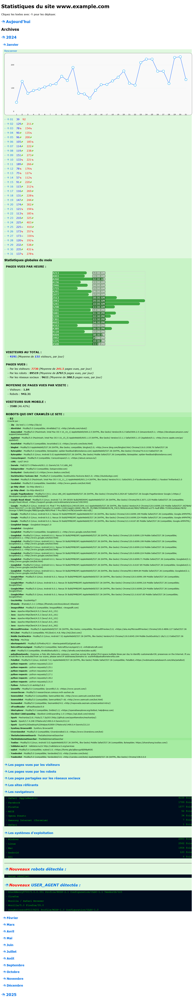

# C2Stats - Script de statistiques PHP

C2Stats est un script PHP gratuit **sans base de données** et open source permettant d'avoir des statistiques journalières, mensuelles et annuelles pour votre site web.

## Aperçu



## Fonctionnalités

- 📊 Total des visiteurs uniques
- 📄 Nombre de pages vues
- 📈 Moyenne de pages visitées par visite
- 🔗 Sites référents (d'où viennent vos visiteurs)
- 📱 Détection mobile
- 🤖 Détection des robots/bots
- 🌐 Pages partagées sur les réseaux sociaux
- 💻 Navigateurs et systèmes d'exploitation détectés

## Installation

1. Envoyez le dossier C2stats sur votre site (à la racine ou là où vous voulez)
2. Ajoutez ce code à la fin de vos pages, après `</html>` :

```php
<?php
define('C2STATS', true);
include __DIR__ . '/C2stats/includes/footer-script.php';
?>
```

3. Configurez la tâche CRON pour `C2stats/cron/jour.php` (à lancer chaque jour à minuit)
4. Accédez aux statistiques via : `example.com/C2stats`

## Configuration

Modifiez le fichier `includes/config.php` pour configurer :
- L'envoi de emails
- Autres options

## Fichiers importants

- `txt/listes/bots.txt` - Liste des bots détectés
- `txt/listes/reseaux-sociaux.txt` - Réseaux sociaux reconnus
- `txt/listes/ignores.txt` - User agents à ignorer
- `txt/listes/bots-website-links.txt` - Liens vers les sites des bots

## Crédits

Script réalisé par Steve TENZA ([c2script.com](https://www.c2script.com))

## Licence

Gratuit et open source